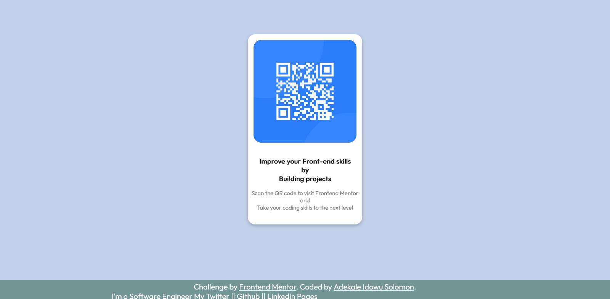

# Frontend Mentor - QR code component solution

This is a solution to the [QR code component challenge on Frontend Mentor](https://www.frontendmentor.io/challenges/qr-code-component-iux_sIO_H). Frontend Mentor challenges help you improve your coding skills by building realistic projects. 

## Table of contents

- [Overview](#overview)
  - [Screenshot](#screenshot)
  - [Links](#links)
- [My process](#my-process)
  - [Built with](#built-with)
  - [What I learned](#what-i-learned)
  - [Continued development](#continued-development)
  - [Useful resources](#useful-resources)
- [Author](#author)
- [Acknowledgments](#acknowledgments)

**Note: Delete this note and update the table of contents based on what sections you keep.**

## Overview

### Screenshot



### Links

- Solution URL: [Add solution URL here](https://your-solution-url.com)
- Live Site URL: [Add live site URL here](https://your-live-site-url.com)

## My process

### Built with

- HTML 5 Markup
- CSS stylesheet


### What I learned

Use this section to recap over some of your major learnings while working through this project. Writing these out and providing code samples of areas you want to highlight is a great way to reinforce your own knowledge.

To see how you can add code snippets, see below:

```html
<h1>Some HTML code I'm proud of is: the Marquee element and the amazing font-family given</h1>
```
```css
.footer {
    position: fixed;
    left: 0;
    bottom: 0;
    width: 100%;
    height: 50px;
    background-color: rgb(116, 150, 150);
    color: white;
    text-align: center;
}
```
```js
None
```

### Continued development
None for now

### Useful resources

- [Example resource 1](https://www.W3school.com) - This helped me for the footer. I really liked this pattern and will use it going forward.

## Author

- Blog - [Add your name here](https://idowublog.hashnode.dev/)
- Frontend Mentor - [@yourusername](https://www.frontendmentor.io/profile/idowuadekale)
- Twitter - [@yourusername](https://www.twitter.com/IdowuAdekale)


## Acknowledgments
I will like to thank my Uncle who is also a Full Stack Engineer. He have been helping since my arrival in the tech world, Thank you.

